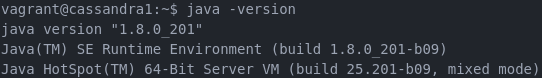
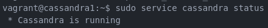
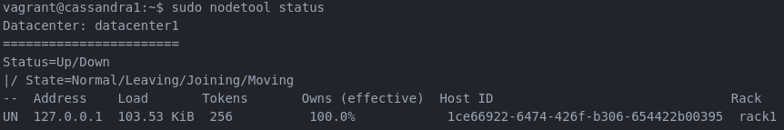
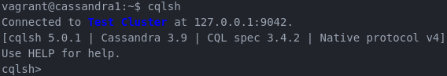
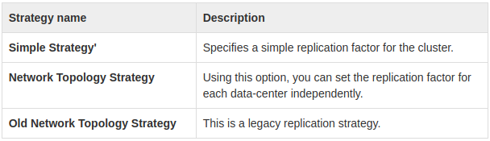

# Instalasi Cassandra Single Node

## Outline
1. [Detail Tugas](#detail-tugas)
2. [Pengerjaan](#pengerjaan)
  - [Perbedaan Cassandra dengan database NoSQL lain](#perbedaan-cassandra-dengan-database-nosql-lain)
  - [Arsitektur Server](#arsitektur-server)
  - [Instalasi](#instalasi)
      - [Konfigurasi Vagrant](#konfigurasi-vagrant)
      - [Instalasi Oracle Java Virtual Machine](#instalasi-oracle-java-virtual-machine)
      - [Instalasi Cassandra](#instalasi-cassandra)
      - [Cek Koneksi Cluster](#cek-koneksi-cluster)
  - [Penjelasan Dataset](#penjelasan-dataset)
  - [Import Dataset](#import-dataset)
  - [CRUD data](#crud-data)

## Detail Tugas
1. Buatlah implementasi instalasi Cassandra single node & operasi CRUD yang dilakukan
2. Pilih dataset dengan format CSV untuk diimport ke dalam Cassandra. Dataset dapat dicari dari:
  - [Kaggle](kaggle.com)
  - [awesomedata/awesome-public-datasets](https://github.com/awesomedata/awesome-public-datasets)
  - atau sumber dataset lain yang kredibel
  - untuk mencegah adanya mahasiswa yang menggunakan dataset yang sama, maka isikan dataset yang dipilih pada link spreadsheet terlampir.
3. Lakukan import data CSV ke dalam Cassandra dan lakukan operasi CRUD ke dalam database Cassandra

### Pengumpulan
1. Buatlah dokumentasi yang berisi:
  - penjelasan mengenai apa itu database Cassandra dan apa perbedaannya dengan database relational dan database NoSQL lainnya.
  - arsitektur server
  - proses instalasi
  - dataset pilihan dan penjelasan
  - proses import dataset ke dalam Cassandra
  - proses CRUD data di dalam database Cassandra
  Dokumentasi tiap tahapan harus diberikan PENJELASAN dan SCREENSHOT
2. Dokumentasi dikumpulkan di GitHub dalam bentuk MarkDown (.md).
3. Pengumpulan dilakukan dengan cara menuliskan URL Github pada assignment ini.

## Perbedaan Cassandra dengan database NoSQL Lain
Cassandra adalah salah satu produk *open source database manager* dari Apache yang sangat *scalable* dan dirancang untuk mengelola data tak terstruktur dan berukuran masif. Cassandra dapat menghandle *load* aplikasi seperti [Instagram](instagram.com) yang tiap harinya terdapat kurang lebih 80 juta foto terunggah.

#### Cassandra vs MongoDB
Cassandra|MongoDB
---|---
Model data lebih terstruktur | Model data dapat bervariasi
*Indexing* terbatas | Sangat mendukung *indexing*
Menggunakan *multiple master* model menjadikan tingkat ketersediaan sangat tinggi|Menggunakan *master-slave* model, ketika master down diperlukan sekitar 10-40 detik pemindahan master. Dalam kondisi ini tidak dapat dilakukan *write* ke database.
Mendukung *query language* | Tidak mengukung *query language*

## Arsitektur Server
IP|Hostname|Task
--|--------|----
192.168.33.11|cassandra1|servicenode, storage

## Instalasi
### Konfigurasi Vagrant
Konfigurasi bisa dilihat di [sini](../Vagrantfile)

### Instalasi Oracle Java Virtual Machine
1. ssh ke node yang telah dibuat
    - `vagrant ssh cassandra1`
2. jalankan perintah ini di terminal
    - `sudo add-apt-repository ppa:webupd8team/java`
    - `sudo apt-get update`
    - `sudo apt-get install oracle-java8-set-default`
    - `java -version` (opsional, untuk mengecek ulang apakah java telah diinstall)

    

### Instalasi Cassandra
- jalankan di terminal
    - `echo "deb http://www.apache.org/dist/cassandra/debian 22x main" | sudo tee -a /etc/apt/sources.list.d/cassandra.sources.list`
    - `echo "deb-src http://www.apache.org/dist/cassandra/debian 22x main" | sudo tee -a /etc/apt/sources.list.d/cassandra.sources.list`
    - `gpg --keyserver pgp.mit.edu --recv-keys F758CE318D77295D`
    - `gpg --export --armor F758CE318D77295D | sudo apt-key add -`
    - `gpg --keyserver pgp.mit.edu --recv-keys 2B5C1B00`
    - `gpg --export --armor 2B5C1B00 | sudo apt-key add -`
    - `gpg --keyserver pgp.mit.edu --recv-keys 0353B12C`
    - `gpg --export --armor 0353B12C | sudo apt-key add -`
    - `sudo apt-get update`
    - `sudo apt-get install cassandra`

    

### Cek Koneksi Cluster
1. Mengecek status cluster
    - `sudo nodetool status`

    

    - `cqlsh`

    

## Penjelasan Dataset
Dataset: [FIFA 19 complete player dataset](https://www.kaggle.com/karangadiya/fifa19)

Atribut detail dari setiap pemain yang telah teregistrasi dalam database edisi terbaru FIFA 19

## Import Dataset
1. ssh ke cassandra1
2. unduh dataset
  - `wget https://github.com/faizalmuzakki/dd-2019/raw/master/Cassandra/SingleNode/data.csv`
3. `cqlsh` di terminal
4. buat keyspace
  - `CREATE KEYSPACE test
    WITH REPLICATION = {
      'class' : 'NetworkTopologyStrategy', 'datacenter1' : 1
    };`
  - penjelasan *replication class*
  
5. `use test` di terminal
6. buat tabel
  - `CREATE TABLE players(
    ID int,
    Name text,
    Age int,
    Photo text,
    Nationality text,
    Flag text,
    Overall int,
    Potential int,
    Club text,
    Club_Logo text,
    Value text,
    Wage text,
    Special int,
    Preferred_Foot text,
    International_Reputation int,
    Weak_Foot int,
    Skill_Moves int,
    Work_Rate text,
    Body_Type text,
    Real_Face Boolean,
    Position text,
    Jersey_Number int,
    Joined date,
    Loaned_From text,
    Contract_Valid_Until text,
    Height text,
    Weight text,
    LS text,
    ST text,
    RS text,
    LW text,
    LF text,
    CF text,
    RF text,
    RW text,
    LAM text,
    CAM text,
    RAM text,
    LM text,
    LCM text,
    CM text,
    RCM text,
    RM text,
    LWB text,
    LDM text,
    CDM text,
    RDM text,
    RWB text,
    LB text,
    LCB text,
    CB text,
    RCB text,
    RB text,
    Crossing int,
    Finishing int,
    HeadingAccuracy int,
    ShortPassing int,
    Volleys int,
    Dribbling int,
    Curve int,
    FKAccuracy int,
    LongPassing int,
    BallControl int,
    Acceleration int,
    SprintSpeed int,
    Agility int,
    Reactions int,
    Balance int,
    ShotPower int,
    Jumping int,
    Stamina int,
    Strength int,
    LongShots int,
    Aggression int,
    Interceptions int,
    Positioning int,
    Vision int,
    Penalties int,
    Composure int,
    Marking int,
    StandingTackle int,
    SlidingTackle int,
    GKDiving int,
    GKHandling int,
    GKKicking int,
    GKPositioning int,
    GKReflexes int,
    Release_Clause text,
    PRIMARY KEY (ID)
  );`
7. Import dataset
  - `COPY players(
      ID,
      Name,
      Age,
      Photo,
      Nationality,
      Flag,
      Overall,
      Potential,
      Club,
      Club_Logo,
      Value,
      Wage,
      Special,
      Preferred_Foot,
      International_Reputation,
      Weak_Foot,
      Skill_Moves,
      Work_Rate,
      Body_Type,
      Real_Face,
      Position,
      Jersey_Number,
      Joined,
      Loaned_From,
      Contract_Valid_Until,
      Height,
      Weight,
      LS,
      ST,
      RS,
      LW,
      LF,
      CF,
      RF,
      RW,
      LAM,
      CAM,
      RAM,
      LM,
      LCM,
      CM,
      RCM,
      RM,
      LWB,
      LDM,
      CDM,
      RDM,
      RWB,
      LB,
      LCB,
      CB,
      RCB,
      RB,
      Crossing,
      Finishing,
      HeadingAccuracy,
      ShortPassing,
      Volleys,
      Dribbling,
      Curve,
      FKAccuracy,
      LongPassing,
      BallControl,
      Acceleration,
      SprintSpeed,
      Agility,
      Reactions,
      Balance,
      ShotPower,
      Jumping,
      Stamina,
      Strength,
      LongShots,
      Aggression,
      Interceptions,
      Positioning,
      Vision,
      Penalties,
      Composure,
      Marking,
      StandingTackle,
      SlidingTackle,
      GKDiving,
      GKHandling,
      GKKicking,
      GKPositioning,
      GKReflexes,
      Release_Clause
    ) FROM '/home/vagrant/data.csv' WITH DELIMITER = ',' AND HEADER = TRUE;`

## CRUD Data
