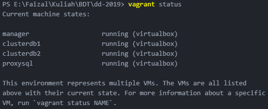

# Tugas ETS

## Jump To
- [Instruksi](#instruksi)
- [Pengumpulan](#pengumpulan)
- [Arsitektur](#arsitektur)

### INSTRUKSI
1. Buatlah sebuah cluster MySQL menggunakan NDB Engine + 1 buah ProxySQL
2. Install aplikasi yang siap digunakan (seperti Wordpress, Joomla, atau CMS yang lain).
- Aplikasi dapat diinstal di node yang sama dengan ProxySQL, atau bisa juga menambahkan 1 node baru.
- Jangan lupa untuk mengubah SQL create table untuk menggunakan NDB Engine
3. Lakukan simulasi yang menunjukkan adanya fail over (salah satu node service atau data dimatikan) dan aplikasi masih dapat berfungsi dengan baik.
4. Lakukan pengukuran response time (load test) menggunakan JMeter.
Bagaimana cara menggunakan JMeter dapat dicari dengan mudah di Google atau Youtube.

### PENGUMPULAN

##### A. Dokumentasi yang berisi:
1. Arsitektur dan proses instalasi yang dilakukan.
2. Dokumentasi pengetesan menggunakan JMeter

##### B. Demo di kelas
Melakukan demo di kelas.

### Artitektur
Arsitektur sama dengan tugas sebelumnya

IP|Hostname|Task
--|--------|----
192.168.33.11|manager|Manager, servicenode
192.168.33.12|clusterdb2|Datanode, servicenode
192.168.33.13|clusterdb3|Datanode
192.168.33.14|proxysql|ProxySQL, Wordpress Node

### Install Wordpress
- SSH ke proxysql
    - `vagrant ssh proxysql`
- Install apache dan php
    - `sudo apt-get install -y apache2 php libapache2-mod-php php-mcrypt php-mysql`
- Konfigurasi package wordpress
    - `wget -c http://wordpress.org/latest.tar.gz`
    - `tar -xzvf latest.tar.gz`
    - `sudo mv wordpress/* /var/www/html/`
- Set directory permission
    - `sudo chown -R www-data:www-data /var/www/html/`
    - `sudo chmod -R 755 /var/www/html/`
- Restart apache
    - `sudo systemctl restart apache2`
