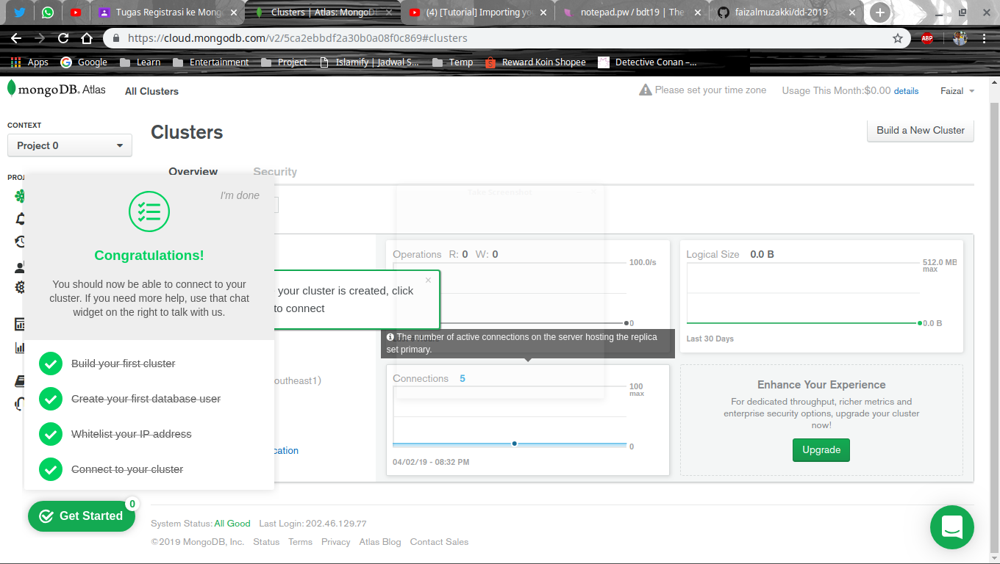
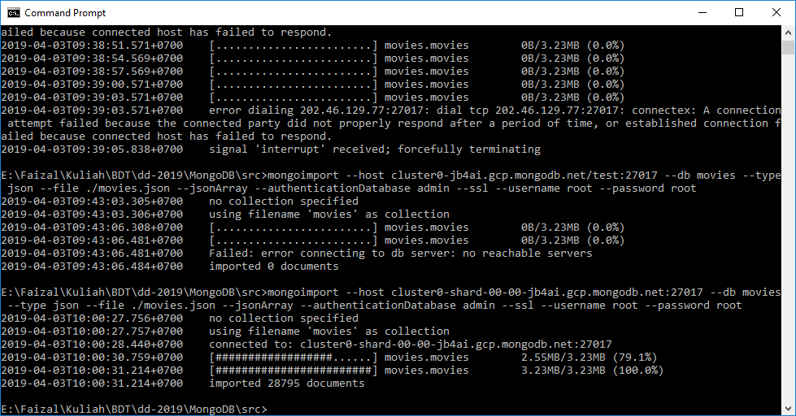

# Tugas Registrasi ke MongoDB Atlas

#### Detail Tugas
1. Lakukan registrasi ke MongoDB Atlas untuk mendapatkan akses ke cluster MongoDB.
2. Pilih dataset bertipe JSON dan import ke dalam cluster kalian. Bagaimana cara import dapat dilihat pada tutorial terlampir.
3. Akses data menggunakan MongoDB Compass dan tunjukkan bahwa data yang diimport berhasil dimasukkan.

#### Tutorial
- [https://www.mongodb.com/cloud/atlas](https://www.mongodb.com/cloud/atlas)
- [https://www.youtube.com/watch?v=tpz-6Trd1UI](https://www.youtube.com/watch?v=tpz-6Trd1UI)

### Registrasi ke MongoDB Atlas

### Pilih dataset bertipe JSON dan import

- [movie-dataset](https://raw.githubusercontent.com/prust/wikipedia-movie-data/master/movies.json)

- How to import
    - Install mongoimport
    - Jalankan di terminal
        - `mongoimport --host <your_host>:27017 --db movies --type json --file ./movies.json --jsonArray --authenticationDatabase admin --ssl --username <your_username> --password <your_password>`
        

