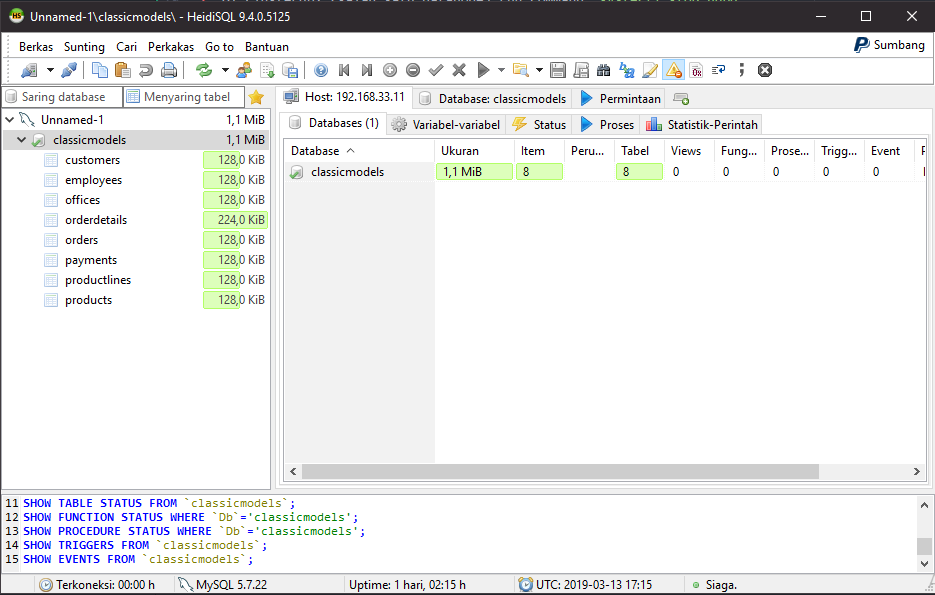
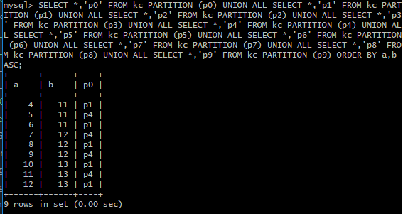

# Distributed Database - 2019
## 0511164000120 - Faizal Khilmi Muzakki

## Jump To
1. [Tugas 1](#tugas-1---implementasi-mysql-cluster)
2. [Tugas 2](#tugas-2---implementasi-partisi)

## Tugas 1 - Implementasi MySQL Cluster

###### Database: http://www.mysqltutorial.org/mysql-sample-database.aspx

#### Artitektur
IP|Hostname|Task
--|--------|----
192.168.33.11|manager|Manager, servicenode
192.168.33.12|clusterdb2|Datanode, servicenode
192.168.33.13|clusterdb3|Datanode
192.168.33.14|proxysql|ProxySQL

#### Manager

#### Testing NDBCluster
1. Pastikan status ndbd di datanode adalah running dan tabel menggunakan engine `ndbcluster`
2. Di clusterdb2 (salah satu datanode) run command `systectl stop ndbd`
3. Status node manager:

4. Hasil akses melalui servicenode:

Sukses, telah dialihkan ke datanode ke-2

#### ProxySQL

#### Test akses dari HeidiSQL

## Tugas 2 - Implementasi Partisi

#### 1. Mengecek apakah plugin partition telah aktif (command dan screenshot hasil)

#### 2. Create partition --> buat tabel dan contoh insert data dan hasil query-nya
##### Range partition
- contoh tabel "userslogs" dan "rc1"

    `CREATE TABLE userslogs (username VARCHAR(20) NOT NULL,logdata BLOB NOT NULL,created DATETIME NOT NULL,PRIMARY KEY(username, created))PARTITION BY RANGE( YEAR(created) )(PARTITION from_2013_or_less VALUES LESS THAN (2014),PARTITION from_2014 VALUES LESS THAN (2015),PARTITION from_2015 VALUES LESS THAN (2016),PARTITION from_2016_and_up VALUES LESS THAN MAXVALUE);`

    

    `CREATE TABLE rc1 (a INT,b INT)PARTITION BY RANGE COLUMNS(a, b) (PARTITION p0 VALUES LESS THAN (5, 12),PARTITION p3 VALUES LESS THAN (MAXVALUE, MAXVALUE));`

    

- Jalankan contoh query untuk tabel "rc1"

    `INSERT INTO rc1 (a,b) VALUES (4,11);INSERT INTO rc1 (a,b) VALUES (5,11);INSERT INTO rc1 (a,b) VALUES (6,11);INSERT INTO rc1 (a,b) VALUES (4,12);INSERT INTO rc1 (a,b) VALUES (5,12);INSERT INTO rc1 (a,b) VALUES (6,12);INSERT INTO rc1 (a,b) VALUES (4,13);INSERT INTO rc1 (a,b) VALUES (5,13);INSERT INTO rc1 (a,b) VALUES (6,13);`

    

    `SELECT *,'p0' FROM rc1 PARTITION (p0) UNION ALL SELECT *,'p3' FROM rc1 PARTITION (p3) ORDER BY a,b ASC;`

    

##### List Partition
  - contoh tabel "serverlogs" dan "lc"

    `CREATE TABLE serverlogs (serverid INT NOT NULL,logdata BLOB NOT NULL,created DATETIME NOT NULL)PARTITION BY LIST (serverid)(PARTITION server_east VALUES IN(1,43,65,12,56,73),PARTITION server_west VALUES IN(534,6422,196,956,22));`

    

    `CREATE TABLE lc (a INT NULL,b INT NULL)PARTITION BY LIST COLUMNS(a,b) (PARTITION p0 VALUES IN( (0,0), (NULL,NULL) ),PARTITION p1 VALUES IN( (0,1), (0,2), (0,3), (1,1), (1,2) ),PARTITION p2 VALUES IN( (1,0), (2,0), (2,1), (3,0), (3,1) ),PARTITION p3 VALUES IN( (1,3), (2,2), (2,3), (3,2), (3,3) ));`

    

  -  Jalankan contoh query untuk tabel "lc"

  `INSERT INTO lc (a,b) VALUES (0,0), (NULL,NULL), (0,1), (0,2), (0,3), (1,1), (1,2), (1,0), (2,0), (2,1), (3,0), (3,1), (1,3), (2,2), (2,3), (3,2), (3,3);`

  

  `SELECT *,'p0' FROM lc PARTITION (p0) UNION ALL SELECT *,'p1' FROM lc PARTITION (p1) UNION ALL SELECT *,'p2' FROM lc PARTITION (p2) UNION ALL SELECT *,'p3' FROM lc PARTITION (p3) ORDER BY a,b ASC;`

  

##### Hash Partition
  - contoh tabel "serverlogs2" dan "hc"

  `CREATE TABLE serverlogs2 (serverid INT NOT NULL, logdata BLOB NOT NULL,created DATETIME NOT NULL) PARTITION BY HASH (serverid) PARTITIONS 10;`

  

  `CREATE TABLE hc (a INT NULL,b INT NULL) PARTITION BY HASH (a) PARTITIONS 5;`

  

  - Jalankan contoh query untuk tabel "hc"

  `INSERT INTO hc (a,b) VALUES (0,0), (NULL,NULL), (0,1), (0,2), (0,3), (1,1), (1,2), (1,0), (2,0), (2,1), (3,0), (3,1), (1,3), (2,2), (2,3), (3,2), (3,3);`

  

  `SELECT *,'p0' FROM hc PARTITION (p0) UNION ALL SELECT *,'p1' FROM hc PARTITION (p1) UNION ALL SELECT *,'p2' FROM hc PARTITION (p2) UNION ALL SELECT *,'p3' FROM hc PARTITION (p3) ORDER BY a,b ASC;`

  

##### Key Partition
  - contoh tabel "serverlogs4" dan "kc"

  `CREATE TABLE serverlogs4 (serverid INT NOT NULL, logdata BLOB NOT NULL, created DATETIME NOT NULL, UNIQUE KEY (serverid)) PARTITION BY KEY() PARTITIONS 10;`

  

  `CREATE TABLE kc (a INT NULL,b INT NULL,UNIQUE KEY (a)) PARTITION BY KEY(a) PARTITIONS 10;`

  

  - Jalankan contoh query untuk tabel "kc"

  `INSERT INTO kc (a,b) VALUES (4,11);INSERT INTO kc (a,b) VALUES (5,11);INSERT INTO kc (a,b) VALUES (6,11);INSERT INTO kc (a,b) VALUES (7,12);INSERT INTO kc (a,b) VALUES (8,12);INSERT INTO kc (a,b) VALUES (9,12);INSERT INTO kc (a,b) VALUES (10,13);INSERT INTO kc (a,b) VALUES (11,13);INSERT INTO kc (a,b) VALUES (12,13);`

  

  `SELECT *,'p0' FROM kc PARTITION (p0) UNION ALL SELECT *,'p1' FROM kc PARTITION (p1) UNION ALL SELECT *,'p2' FROM kc PARTITION (p2) UNION ALL SELECT *,'p3' FROM kc PARTITION (p3) UNION ALL SELECT *,'p4' FROM kc PARTITION (p4) UNION ALL SELECT *,'p5' FROM kc PARTITION (p5) UNION ALL SELECT *,'p6' FROM kc PARTITION (p6) UNION ALL SELECT *,'p7' FROM kc PARTITION (p7) UNION ALL SELECT *,'p8' FROM kc PARTITION (p8) UNION ALL SELECT *,'p9' FROM kc PARTITION (p9) ORDER BY a,b ASC;`

  

#### 3. Testing pada bagian "A Typical Use Case: Time Series Data"

Dataset: [Ini](https://drive.google.com/file/d/0B2Ksz9hP3LtXRUppZHdhT1pBaWM/view)

##### Menguji SELECT

- Gunakan perintah EXPLAIN untuk melihat plan eksekusi query untuk masing-masing tabel

  `explain select * from measures;`
  `explain select * from partitioned_measures;`

  

- Jalankan query benchmark untuk masing-masing tabel. Hasilnya adalah running time.

  `SELECT SQL_NO_CACHE COUNT(*) FROM time_series.measures
  WHERE measure_timestamp >= '2016-01-01' AND DAYOFWEEK(measure_timestamp) = 1;`

  `SELECT SQL_NO_CACHE COUNT(*) FROM time_series.partitioned_measures WHERE measure_timestamp >= '2016-01-01' AND DAYOFWEEK(measure_timestamp) = 1;`

  

- Jalankan query delete (bagian BIG DELETE) dan tampilkan perbedaan running time-nya.

  `DELETE FROM time_series.measures WHERE  measure_timestamp < '2016-01-01';`

  `ALTER TABLE time_series.partitioned_measures DROP PARTITION prev_year_logs;`

  
