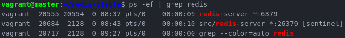
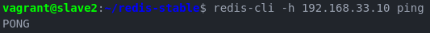
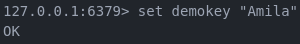
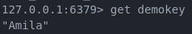
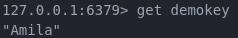
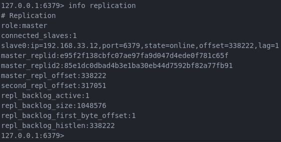
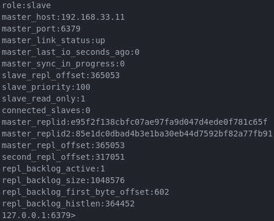

## Tugas Implementasi Redis

### Outline
- [Detail Tugas](#detail-tugas)
- [Arsitektur](#arsitektur)
- [Instalasi](#instalasi)
  - [Initial Setup](#initial-setup)
  - [Konfigurasi Redis](#konfigurasi-redis)
  - [Menjalankan Redis](#menjalankan-redis)
- [Tes Failover](#failover-test)

### Arsitektur
IP|Hostname|Task|Memory
--|--------|----|---
192.168.33.10|master|Initial Master Node|1024
192.168.33.11|slave1|Initial Slave Node|1024
192.168.33.12|slave2|Initial Slave Node|1024

### Detail Tugas
1. Buatlah implementasi instalasi Redis cluster/Redis Sentinel.
2. Lakukan proses CRUD data pada Redis
3. Lakukan simulasi fail over pada Redis cluster (sesuai dengan contoh yang ada pada tutorial di materi kuliah sebelumnya)

### Instalasi
#### Initial Setup
- Install prerequisite (Jalankan di setiap node):
  - `sudo apt-get update `
  - `sudo apt-get install build-essential tcl`
  - `sudo apt-get install libjemalloc-dev #(Optional)`

- Install Redis (Jalankan di setiap node):
  - `curl -O http://download.redis.io/redis-stable.tar.gz`
  - `tar xzvf redis-stable.tar.gz`
  - `cd redis-stable`
  - `make`
  - `make test`
  - `sudo make install`

- Cek ketersediaan file redis.conf dan sentinel.conf

- Konfigurasi firewall (di setiap node)
  - `sudo ufw allow 6379 #port redis-server`
  - `sudo ufw allow 26379 #port redis-sentinel`

#### Konfigurasi Redis

- Pada master, ubah konten redis.conf menjadi sebagai berikut:
  - `protected-mode no`
  - `port 6379`
  - `dir .`
  - `logfile "/home/vagrant/redis-stable/redis.log"`
- redis.conf pada slave node:
  - `protected-mode no`
  - `port 6379`
  - `dir .`
  - `slaveof 192.168.33.10 6379`
  - `logfile "/home/vagrant/redis-stable/redis.log"`
- sentinel.conf (slave dan master kofigurasinya sama)
  - `protected-mode no`
  - `port 26379`
  - `logfile "/home/vagrant/redis-stable/sentinel.log"`
  - `sentinel monitor mymaster 192.168.33.10 6379 2`
  - `sentinel down-after-milliseconds mymaster 5000`
  - `sentinel failover-timeout mymaster 10000`

Penjelasan:
- Perbedaan di redis.conf pada 3 node adalah: slave node harus memiliki konfigurasi -> `slave of 192.1689.33.10 6379` yang berarti node slave merupakan slave instance dari node master (192.16.33.10)

#### Menjalankan Redis
- Jalankan di tiap node (Pastikan anda berada pada folder /home/user/redis-stable)
  - `src/redis-server redis.conf &
src/redis-server sentinel.conf --sentinel &`

- Cek redis proses yang berjalan dengan cara
  - `ps -ef | grep redis`

  

- Pastikan redis service di setiap node berjalan dengan baik alias _connect_ ke master
  - Master

  - Slave1

  - Slave2

- Cek status replikasi

- Test Redis
  - Master

  - Slave1

  - Slave2

### Failover Test
Dapat disimulasikan dengan cara (jalankan _command_ di master node):
- `kill -9 <process id>`, atau
- `redis-cli -p 6379 DEBUG sleep 30`, atau
- `redis-cli -p 6379 DEBUG SEGFAULT`

Cek info replication di tiap node
- Slave1

- Slave2

Dengan demikian menandakan master telah berpindah dari 192.168.33.10 (node master) ke 192.168.33.11 (node slave1)

#### Referensi
[Redis Sentinel — High Availability: Everything you need to know from DEV to PROD: Complete Guide](https://medium.com/@amila922/redis-sentinel-high-availability-everything-you-need-to-know-from-dev-to-prod-complete-guide-deb198e70ea6) oleh Amila Iddamalgoda
